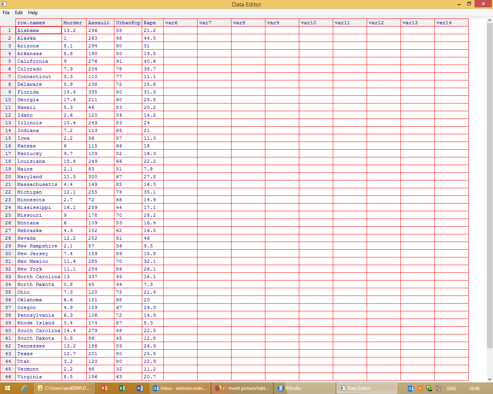

## Introduction

There are several data types in R. The four main types of data.

 * Lists
 * Vectors
 * Matrices
 * Data frames

```{r data types}
###Vectors contain similar elements. It can be numeric or characters#####
###The simplest way to create a vector is to use the function c () combine####
b = c(1, 3, 2, 6)
class(b)
```

```{r}
### Alternatively, we can create a vector of the characters with the name of European cities####
cities = c('Madrid', 'London', 'Ostrava', 'Pekin', 'Barcelona')
class(cities)
```

```{r}
###We can also check the length of the vector by using the lenght () function
length(b)  # It contains 4 observation, 4 elements. It determines the number of elements in the vector

### In the case of a character vector, we need to use the nchar () function to count the number of characters of each element
nchar(cities)  #
```


## Dataframes

Sometimes data require more complex storage than simple vectors and thankfully R provides a host of data structures. The most common are *the data.frame*, matrix, list, and vectors. Perhaps, the data frame will be most familar to anyone who has used Excel spreadsheet.

## Learning outcomes

* Understand what a dataframe is 
* Know how to access to any element of the dataframe
* Practice with a very simple dataframe

## Data.frames

The structure of the data.frame is similar to an Excel spreadsheet. Each column represents a variable, and each row is an observation. Data frames might contain different types of data (numeric, character, logical, etc)

```{r}
#Load the sample dataset: USArrests
data(USArrests)
USArrests
# You can also make quick changes in the dataset with the fix () command
fix(USArrests) # editing your dataset. Similar to the edit command in Stata
```


```{r, out.width = "300px"}

```


## Basic operations with data.frames

```{r}
nrow(USArrests) ## Number of rows. Number of observations = 50 US states
ncol(USArrests) ## Number of variables in the dataset.  4 variables
## Alternatively, 
dim(USArrests) ## Number of rows and columns of our dataset. with dimension function. 
```

## Basic operations with data.frames
```{r}
names(USArrests) ## names of the variables in the dataset
colnames(USArrests)  ## checking the names of the variables

#These functions return a character vector listing the columns 
names(USArrests)[1] ##We pick up the first element of the vector

# The same logic applies to the rows of our dataset

rownames(USArrests) ## Checking the row names
rownames(USArrests)[50]  ## Selecting Wyoming state
```

# Simple inspection of the dataframe

We can also print out the first part or the last part of the dataframe to have an idea how it looks like.  For that purpose, we employ the *head ()* and *tail ()* functions. **These functions can be used not only for data.frames but also for vectors, lists**.

```{r}
head(USArrests)  # Display the first 6 rows in the dataset
head(USArrests, 4)  #Display the first 4 rows in the dataset

tail(USArrests)  # Display the last 6 rows of our dataset

# For instance, let us create a numerical vector
x = c(1,2,3,4,5,6, 7, 8, 9, 10)
head(x)  ## it returns the first 6 elements of the vector

```

## The str function

The str function is one of the most useful in R. It provides you with lot of information about the structure of the object. It can be applied for **data.frames**, **vectors**, **lists**, and **matrices**.

```{r}
str(USArrests)  ## it provides you with information about observations, variables, type of variables, and the values of each column
```


## Manipulating data.frames

Each column of the dataframe is an individual vector, and it can be accessed individually and each column has its own class.

The easiest way to get access to one of the columns of the dataframe is by using the dollar operator ($)
```{r}
USArrests$Murder  ## we get the murder variable, the first column
length(USArrests$Murder)  ## Number of observations = 50
```

## Manipulating dataframes

Similar to vectors, dataframes allow us to access individual elements by their position in square brackets. Two positions must be specified. The first one is the row number, and the second one is the column number. Here we go with some examples

```{r}
USArrests[3,2]  ##Third row from the second column
USArrests [, 3]  ## Only the third column and all rows
USArrests[, 'UrbanPop']  ## Using the name of the column (variable)
USArrests[50, ]  ## All of row 50, all variables
```

## Creating your own dataframe

Let us create our own dataset in R. By rows, we will get individuals, and by columns the variables. We have got information about the age of respondents, sex, and the number of minutes on the phone. As usual, we use the c() function to create vectors.

```{r}
# Use the c() function to create vectors. 
#Notice that we do not mix the type of data into the vectors (numerical or characters)

sex = c("M","H","H","M","M","H","M","M","H","H")
age= c(22, 34, 29, 25, 30, 33, 31, 27, 25, 25)
time = c(14.21, 10.36, 11.89, 13.81, 12.03, 10.99, 12.48, 13.37, 12.29, 11.92)
```

```{r}
mydata = data.frame(age, sex, time)
str(mydata) 
#To check that it is a datframe with 3 variables and 10 observations. Two variables are numeric, and sex is a categorial variable (factor in R)

# Please check the help for data.frame() in R, ?c
```

## Attach command


But the possibilities of creating many errors when using attach are numerous. Referring to the variables in the above dataframe requires the use of the dollar sign, that is, $age, or $sex.

The command attach allows you to do away with the name of the dataframe and the dollar symbol when referring to the same data.

```{r}
attach(mydata)
age
```
One problem with that is that you might have other objects in memory with the same name. In that sense, it is easy to mix up objects


## Subset command

The subset function allows us to select observations and variables. In this case, we are going to create two different data frames: one for males and the other for females.

```{r}
males = subset (mydata, sex =='H')  ## Only for males
males
```
```{r}
females = subset (mydata, sex =='M')  ## Only for females
females
```


### Reading data (some examples)


```{r}
# Reading data from a csv file
# By default, header = TRUE, and sep


countries=read.csv("http://freakonometrics.free.fr/countries.csv",header=TRUE, sep= ';')


# The read.csv & read.csv2 commands are intended to read comma separated value files
# but read.csv2 is quite relevant for countries where they use comma as decimal point and a semicolon as separator  

#check it out

countries1=read.csv2("http://freakonometrics.free.fr/countries.csv",header=TRUE)

# remove  first row in the dataset (blank)

#keep all columns, and remove first row

countries = countries[-1,]

#inspect the dataset (first 6 observations), and the names of the variables in the dataframe

head(countries)
names(countries)

```

### Another example with gapminder

```{r}
gdf <- read.delim("../Labs/data/gapminderDataFiveYear.txt")
head(gdf)
```


```{r}
# Alternatively we can read the file as
gdf1 = read.table('../Labs/data/gapminderDataFiveYear.txt', header = TRUE, sep = '\t')
head(gdf1,4)
library(formattable)
formattable(gdf1, align = c("l", "c", "c", "c", "c", "c"))
```

```{r}
# To know the format of the variables included in the dataframe
sapply(gdf1, class)
str(gdf1)
```

### Description of the dataset

```{r}
summary(gdf1)
anyNA(gdf1)
names(gdf1)
nrow(gdf1)
colnames(gdf1)
```

```{r message=FALSE}
# A more elegant way to inspect the dataset
library(funModeling)
df_status(gdf1)
```


### Manipulating dataframes

```{r}
# Generate a subset of the original dataframe, adn extract the first 5 observations
gdf1[1:5,]
subset(gdf1, gdf1$lifeExp < 30)
gdf1[gdf1$lifeExp < 30, ]

```


```{r message=FALSE}
# Extract data for Czech Republic from the dataframe

gdf1[gdf1$country == 'Czech Republic', c('year', 'lifeExp', 'pop')]

# Generate a data set with only observations for Czech Republic

czech.data = gdf1[gdf1$country == 'Czech Republic', c('year', 'lifeExp', 'pop')]

# Nice way of printing out dataframes with the tibble 

library(dplyr)
czech.table = tbl_df(gdf1[gdf1$country == 'Czech Republic', c('year', 'lifeExp', 'pop')])
czech.table
```
### Other type of datasets
```{r}
library(readr) # from the tidyverse package 
df_csv   = read_csv2("http://freakonometrics.free.fr/countries.csv") # cvs_2 use semi-colon as separator, by default header = TRUE
```

You can also read stata, SAS and SPSS files by using `haven`package.
```{r}
??haven
```

