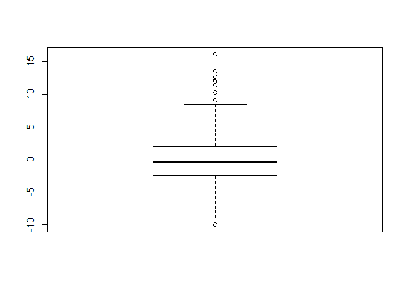
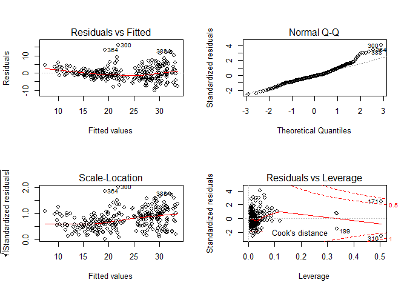

Lab 4: Regression Analysis
================

Regression Analysis
-------------------

``` r
library(caret)
```

    ## Warning: package 'caret' was built under R version 3.6.1

    ## Loading required package: lattice

    ## Loading required package: ggplot2

    ## Warning: package 'ggplot2' was built under R version 3.6.1

``` r
auto <- read.csv("../Labs/data/auto-mpg.csv")
auto$cylinders <- factor(auto$cylinders,
                         levels = c(3,4,5,6,8),
                         labels = c("3c", "4c", "5c", "6c", "8c"))

set.seed(2018)
t.id <- createDataPartition(auto$mpg, p = 0.7, list = F)
names(auto)
```

    ## [1] "No"           "mpg"          "cylinders"    "displacement"
    ## [5] "horsepower"   "weight"       "acceleration" "model_year"  
    ## [9] "car_name"

``` r
mod <- lm(mpg ~ ., data = auto[t.id,-c(1,8,9)])

mod
```

    ## 
    ## Call:
    ## lm(formula = mpg ~ ., data = auto[t.id, -c(1, 8, 9)])
    ## 
    ## Coefficients:
    ##  (Intercept)   cylinders4c   cylinders5c   cylinders6c   cylinders8c  
    ##    37.284202      6.231475      8.248195      2.131026      4.568171  
    ## displacement    horsepower        weight  acceleration  
    ##     0.002245     -0.057543     -0.004665      0.050745

``` r
#mpg = 38.607312 +
#     + 7.212652*4c + 5.610350*5c + 3.307172*6c + 6.211343*8c +
#     + 0.006878 * displacement - 0.072209 * horsepower +
#     - 0.005156 * weight + 0.024852 * acceleration

summary(mod)
```

    ## 
    ## Call:
    ## lm(formula = mpg ~ ., data = auto[t.id, -c(1, 8, 9)])
    ## 
    ## Residuals:
    ##      Min       1Q   Median       3Q      Max 
    ## -10.0606  -2.4686  -0.4435   1.9821  16.0907 
    ## 
    ## Coefficients:
    ##                Estimate Std. Error t value Pr(>|t|)    
    ## (Intercept)  37.2842024  3.6497412  10.216  < 2e-16 ***
    ## cylinders4c   6.2314753  2.4926855   2.500  0.01301 *  
    ## cylinders5c   8.2481946  3.8091396   2.165  0.03123 *  
    ## cylinders6c   2.1310256  2.7759570   0.768  0.44335    
    ## cylinders8c   4.5681710  3.2054454   1.425  0.15527    
    ## displacement  0.0022449  0.0108924   0.206  0.83687    
    ## horsepower   -0.0575428  0.0202773  -2.838  0.00489 ** 
    ## weight       -0.0046652  0.0009999  -4.665 4.84e-06 ***
    ## acceleration  0.0507454  0.1443575   0.352  0.72547    
    ## ---
    ## Signif. codes:  0 '***' 0.001 '**' 0.01 '*' 0.05 '.' 0.1 ' ' 1
    ## 
    ## Residual standard error: 4.092 on 271 degrees of freedom
    ## Multiple R-squared:  0.7304, Adjusted R-squared:  0.7224 
    ## F-statistic: 91.75 on 8 and 271 DF,  p-value: < 2.2e-16

``` r
boxplot(mod$residuals)
```



``` r
sqrt(mean((mod$fitted.values - auto[t.id,]$mpg)^2))
```

    ## [1] 4.026021

``` r
pred <- predict(mod, auto[-t.id, -c(1,8,9)])
sqrt(mean((pred - auto[-t.id,]$mpg)^2))
```

    ## [1] 3.894627

``` r
par(mfrow=c(2,2))
plot(mod)
```



Extracting regression results
-----------------------------

``` r
str(summary(mod))# Within the lm object, we store the main regression output
```

    ## List of 11
    ##  $ call         : language lm(formula = mpg ~ ., data = auto[t.id, -c(1, 8, 9)])
    ##  $ terms        :Classes 'terms', 'formula'  language mpg ~ cylinders + displacement + horsepower + weight + acceleration
    ##   .. ..- attr(*, "variables")= language list(mpg, cylinders, displacement, horsepower, weight, acceleration)
    ##   .. ..- attr(*, "factors")= int [1:6, 1:5] 0 1 0 0 0 0 0 0 1 0 ...
    ##   .. .. ..- attr(*, "dimnames")=List of 2
    ##   .. .. .. ..$ : chr [1:6] "mpg" "cylinders" "displacement" "horsepower" ...
    ##   .. .. .. ..$ : chr [1:5] "cylinders" "displacement" "horsepower" "weight" ...
    ##   .. ..- attr(*, "term.labels")= chr [1:5] "cylinders" "displacement" "horsepower" "weight" ...
    ##   .. ..- attr(*, "order")= int [1:5] 1 1 1 1 1
    ##   .. ..- attr(*, "intercept")= int 1
    ##   .. ..- attr(*, "response")= int 1
    ##   .. ..- attr(*, ".Environment")=<environment: R_GlobalEnv> 
    ##   .. ..- attr(*, "predvars")= language list(mpg, cylinders, displacement, horsepower, weight, acceleration)
    ##   .. ..- attr(*, "dataClasses")= Named chr [1:6] "numeric" "factor" "numeric" "numeric" ...
    ##   .. .. ..- attr(*, "names")= chr [1:6] "mpg" "cylinders" "displacement" "horsepower" ...
    ##  $ residuals    : Named num [1:280] 6.111 -0.628 -2.091 -3.5 -2.351 ...
    ##   ..- attr(*, "names")= chr [1:280] "3" "4" "5" "6" ...
    ##  $ coefficients : num [1:9, 1:4] 37.28 6.23 8.25 2.13 4.57 ...
    ##   ..- attr(*, "dimnames")=List of 2
    ##   .. ..$ : chr [1:9] "(Intercept)" "cylinders4c" "cylinders5c" "cylinders6c" ...
    ##   .. ..$ : chr [1:4] "Estimate" "Std. Error" "t value" "Pr(>|t|)"
    ##  $ aliased      : Named logi [1:9] FALSE FALSE FALSE FALSE FALSE FALSE ...
    ##   ..- attr(*, "names")= chr [1:9] "(Intercept)" "cylinders4c" "cylinders5c" "cylinders6c" ...
    ##  $ sigma        : num 4.09
    ##  $ df           : int [1:3] 9 271 9
    ##  $ r.squared    : num 0.73
    ##  $ adj.r.squared: num 0.722
    ##  $ fstatistic   : Named num [1:3] 91.8 8 271
    ##   ..- attr(*, "names")= chr [1:3] "value" "numdf" "dendf"
    ##  $ cov.unscaled : num [1:9, 1:9] 0.795 -0.338 -0.301 -0.321 -0.285 ...
    ##   ..- attr(*, "dimnames")=List of 2
    ##   .. ..$ : chr [1:9] "(Intercept)" "cylinders4c" "cylinders5c" "cylinders6c" ...
    ##   .. ..$ : chr [1:9] "(Intercept)" "cylinders4c" "cylinders5c" "cylinders6c" ...
    ##  - attr(*, "class")= chr "summary.lm"

``` r
Yhat <-mod$fitted.values
resid <-mod$residuals
coeff <-mod$coefficients
coeff
```

    ##  (Intercept)  cylinders4c  cylinders5c  cylinders6c  cylinders8c 
    ## 37.284202446  6.231475322  8.248194569  2.131025643  4.568170956 
    ## displacement   horsepower       weight acceleration 
    ##  0.002244864 -0.057542812 -0.004665209  0.050745431

``` r
Degress <- mod$df
Degress
```

    ## [1] 271

``` r
summary(mod)$r.squared
```

    ## [1] 0.7303584

``` r
s <-mod$sigma
s
```

    ## NULL

Fancy way using broom package
-----------------------------

``` r
library(broom)
tidy(mod)
```

    ## # A tibble: 9 x 5
    ##   term         estimate std.error statistic  p.value
    ##   <chr>           <dbl>     <dbl>     <dbl>    <dbl>
    ## 1 (Intercept)  37.3      3.65        10.2   6.15e-21
    ## 2 cylinders4c   6.23     2.49         2.50  1.30e- 2
    ## 3 cylinders5c   8.25     3.81         2.17  3.12e- 2
    ## 4 cylinders6c   2.13     2.78         0.768 4.43e- 1
    ## 5 cylinders8c   4.57     3.21         1.43  1.55e- 1
    ## 6 displacement  0.00224  0.0109       0.206 8.37e- 1
    ## 7 horsepower   -0.0575   0.0203      -2.84  4.89e- 3
    ## 8 weight       -0.00467  0.001000    -4.67  4.84e- 6
    ## 9 acceleration  0.0507   0.144        0.352 7.25e- 1

``` r
glance(mod)
```

    ## # A tibble: 1 x 11
    ##   r.squared adj.r.squared sigma statistic  p.value    df logLik   AIC   BIC
    ##       <dbl>         <dbl> <dbl>     <dbl>    <dbl> <int>  <dbl> <dbl> <dbl>
    ## 1     0.730         0.722  4.09      91.8 1.27e-72     9  -787. 1595. 1631.
    ## # ... with 2 more variables: deviance <dbl>, df.residual <int>

Generate LaTeX tables in R
--------------------------

``` r
library(texreg)
```

    ## Warning: package 'texreg' was built under R version 3.6.1

    ## Version:  1.36.23
    ## Date:     2017-03-03
    ## Author:   Philip Leifeld (University of Glasgow)
    ## 
    ## Please cite the JSS article in your publications -- see citation("texreg").

``` r
reg.model <- texreg (mod, file= "mod.tex", 
                      caption.above = T, caption = "Regression results")
```

    ## The table was written to the file 'mod.tex'.
