Lab 5: Basic plots and ggplot package.
================

### Basic plots using R base

-   We will produce basic graphs in R using the dataset (auto.mpg). I am providing the slides and the full code which shows how to build up different plots with the basic syntax in R. It is assumed that you are familiar with descriptive statistics.

### Reading the dataset

``` r
#Check the structure of the dataset
data.auto = read.csv('../Labs/data/auto-mpg.csv')
head(data.auto)
```

    ##   No mpg cylinders displacement horsepower weight acceleration model_year
    ## 1  1  28         4          140         90   2264         15.5         71
    ## 2  2  19         3           70         97   2330         13.5         72
    ## 3  3  36         4          107         75   2205         14.5         82
    ## 4  4  28         4           97         92   2288         17.0         72
    ## 5  5  21         6          199         90   2648         15.0         70
    ## 6  6  23         4          115         95   2694         15.0         75
    ##              car_name
    ## 1 chevrolet vega 2300
    ## 2     mazda rx2 coupe
    ## 3        honda accord
    ## 4     datsun 510 (sw)
    ## 5         amc gremlin
    ## 6          audi 100ls

``` r
attach(data.auto)
```

### Number of cylinders as a categorical variable (factor in R)

``` r
str(cylinders)
```

    ##  int [1:398] 4 3 4 4 6 4 8 4 6 8 ...

``` r
cylinders = factor(cylinders,
levels = c(3,4,5, 6, 8),
labels = c('3cyl', '4cyl', '5cyl', '6cyl', '8cyl'))
head(cylinders)
```

    ## [1] 4cyl 3cyl 4cyl 4cyl 6cyl 4cyl
    ## Levels: 3cyl 4cyl 5cyl 6cyl 8cyl

### Histogram

``` r
hist(acceleration, probability = TRUE)
```


Let us try to refine the histogram by changing some options

``` r
hist(acceleration, 
     main = 'Histogram of accelaration',
     xlab = 'Acceleration',
     col = 'blue')
```


We can also choose the number of break points in hist() as follows:

``` r
hist(acceleration, 
     main = 'Histogram of accelaration',
     xlab = 'Acceleration',
     col = 'blue',
     breaks = 16)
```


### Fitting a density function

``` r
hist(mpg, breaks = 16, prob = T)
lines(density(mpg))
```


### Box plot

``` r
boxplot(mpg, xlab = "Consumption")
```

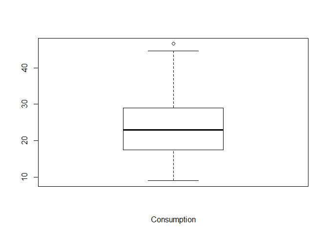

``` r
boxplot(mpg ~ model_year, xlab = "Millas por Galeón (por año)")
```

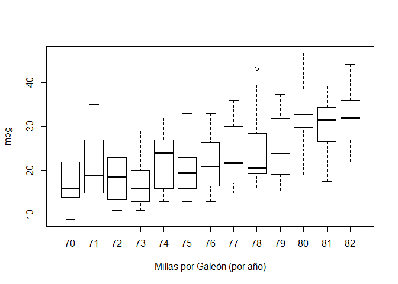

``` r
boxplot(mpg ~ cylinders, xlab = "Consumo por Número de cilindros")
```

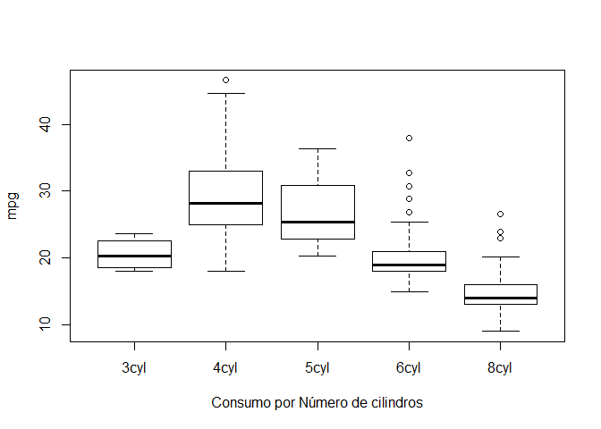

``` r
boxplot(data.auto)
```

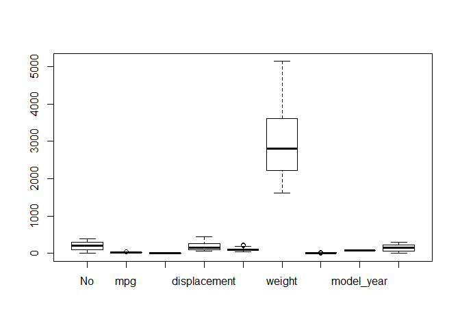

### Simple Scatter Plot

``` r
plot(mpg ~ acceleration, col ='green')
```

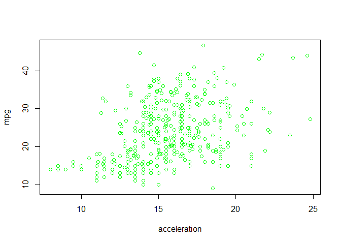

### Fitting a simple regression model

``` r
plot(mpg ~ horsepower)
linearmodel <- lm(mpg ~ horsepower)
abline(linearmodel)
```

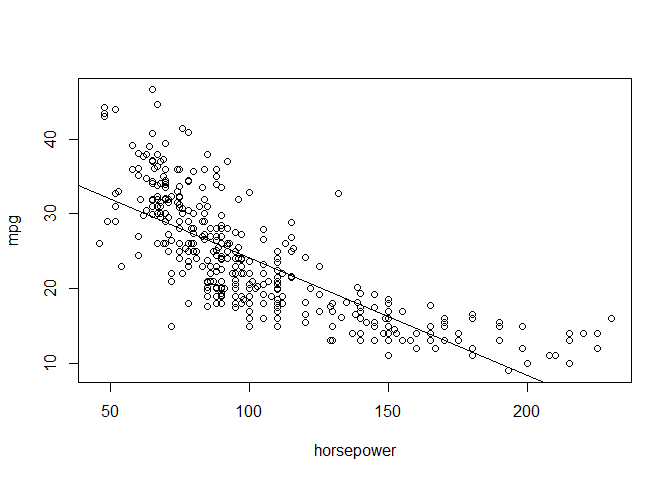

### Scatterplot matrices

We can also create scatter plot matrices with the pairs() function.

``` r
pairs(~mpg + horsepower + weight + acceleration, col ='green')
```

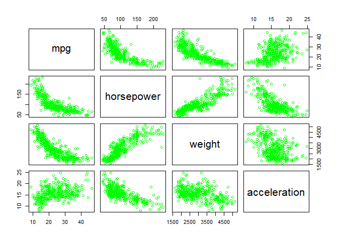

Combination of plots with par ()
--------------------------------

``` r
old.par <- par()
old.par
```

    ## $xlog
    ## [1] FALSE
    ## 
    ## $ylog
    ## [1] FALSE
    ## 
    ## $adj
    ## [1] 0.5
    ## 
    ## $ann
    ## [1] TRUE
    ## 
    ## $ask
    ## [1] FALSE
    ## 
    ## $bg
    ## [1] "white"
    ## 
    ## $bty
    ## [1] "o"
    ## 
    ## $cex
    ## [1] 1
    ## 
    ## $cex.axis
    ## [1] 1
    ## 
    ## $cex.lab
    ## [1] 1
    ## 
    ## $cex.main
    ## [1] 1.2
    ## 
    ## $cex.sub
    ## [1] 1
    ## 
    ## $cin
    ## [1] 0.15 0.20
    ## 
    ## $col
    ## [1] "black"
    ## 
    ## $col.axis
    ## [1] "black"
    ## 
    ## $col.lab
    ## [1] "black"
    ## 
    ## $col.main
    ## [1] "black"
    ## 
    ## $col.sub
    ## [1] "black"
    ## 
    ## $cra
    ## [1] 14.4 19.2
    ## 
    ## $crt
    ## [1] 0
    ## 
    ## $csi
    ## [1] 0.2
    ## 
    ## $cxy
    ## [1] 0.02604167 0.06329116
    ## 
    ## $din
    ## [1] 6.999999 4.999999
    ## 
    ## $err
    ## [1] 0
    ## 
    ## $family
    ## [1] ""
    ## 
    ## $fg
    ## [1] "black"
    ## 
    ## $fig
    ## [1] 0 1 0 1
    ## 
    ## $fin
    ## [1] 6.999999 4.999999
    ## 
    ## $font
    ## [1] 1
    ## 
    ## $font.axis
    ## [1] 1
    ## 
    ## $font.lab
    ## [1] 1
    ## 
    ## $font.main
    ## [1] 2
    ## 
    ## $font.sub
    ## [1] 1
    ## 
    ## $lab
    ## [1] 5 5 7
    ## 
    ## $las
    ## [1] 0
    ## 
    ## $lend
    ## [1] "round"
    ## 
    ## $lheight
    ## [1] 1
    ## 
    ## $ljoin
    ## [1] "round"
    ## 
    ## $lmitre
    ## [1] 10
    ## 
    ## $lty
    ## [1] "solid"
    ## 
    ## $lwd
    ## [1] 1
    ## 
    ## $mai
    ## [1] 1.02 0.82 0.82 0.42
    ## 
    ## $mar
    ## [1] 5.1 4.1 4.1 2.1
    ## 
    ## $mex
    ## [1] 1
    ## 
    ## $mfcol
    ## [1] 1 1
    ## 
    ## $mfg
    ## [1] 1 1 1 1
    ## 
    ## $mfrow
    ## [1] 1 1
    ## 
    ## $mgp
    ## [1] 3 1 0
    ## 
    ## $mkh
    ## [1] 0.001
    ## 
    ## $new
    ## [1] FALSE
    ## 
    ## $oma
    ## [1] 0 0 0 0
    ## 
    ## $omd
    ## [1] 0 1 0 1
    ## 
    ## $omi
    ## [1] 0 0 0 0
    ## 
    ## $page
    ## [1] TRUE
    ## 
    ## $pch
    ## [1] 1
    ## 
    ## $pin
    ## [1] 5.759999 3.159999
    ## 
    ## $plt
    ## [1] 0.1171429 0.9400000 0.2040000 0.8360000
    ## 
    ## $ps
    ## [1] 12
    ## 
    ## $pty
    ## [1] "m"
    ## 
    ## $smo
    ## [1] 1
    ## 
    ## $srt
    ## [1] 0
    ## 
    ## $tck
    ## [1] NA
    ## 
    ## $tcl
    ## [1] -0.5
    ## 
    ## $usr
    ## [1] 0 1 0 1
    ## 
    ## $xaxp
    ## [1] 0 1 5
    ## 
    ## $xaxs
    ## [1] "r"
    ## 
    ## $xaxt
    ## [1] "s"
    ## 
    ## $xpd
    ## [1] FALSE
    ## 
    ## $yaxp
    ## [1] 0 1 5
    ## 
    ## $yaxs
    ## [1] "r"
    ## 
    ## $yaxt
    ## [1] "s"
    ## 
    ## $ylbias
    ## [1] 0.2

``` r
par(mfrow = c(1,2))
with(data.auto, {
  plot(mpg ~ weight, main = "Weight vs Consumption")
  plot(mpg ~ acceleration, main = "Acceleration vs Consumption")
}
)
```

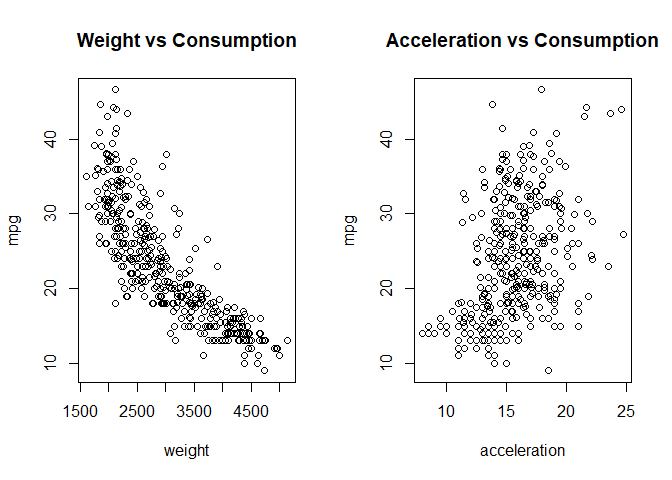

``` r
par(old.par)
```

Introduction to ggplot
----------------------

R provides excellent graphing capabilities with pacakges such as **lattice** and **ggplot2**.

For more details on using R Markdown see <http://rmarkdown.rstudio.com>. We will briefly describe some simple graphs using base graphics from the previous unit and then show their counterparts in ggplot2.

What is ggplot?
---------------

An R package designed to create plots based on a theory of the grammar of the graphics

Why ggplot instead of base R?
-----------------------------

-   nice defaults

-   easy faceting

-   more natural syntax

-   can switch chart types more easily

Reading and checking the structure of the dataset
-------------------------------------------------

``` r
data.auto = read.csv('../Labs/data/auto-mpg.csv')
head(data.auto)
```

    ##   No mpg cylinders displacement horsepower weight acceleration model_year
    ## 1  1  28         4          140         90   2264         15.5         71
    ## 2  2  19         3           70         97   2330         13.5         72
    ## 3  3  36         4          107         75   2205         14.5         82
    ## 4  4  28         4           97         92   2288         17.0         72
    ## 5  5  21         6          199         90   2648         15.0         70
    ## 6  6  23         4          115         95   2694         15.0         75
    ##              car_name
    ## 1 chevrolet vega 2300
    ## 2     mazda rx2 coupe
    ## 3        honda accord
    ## 4     datsun 510 (sw)
    ## 5         amc gremlin
    ## 6          audi 100ls

``` r
attach(data.auto)
```

    ## The following object is masked _by_ .GlobalEnv:
    ## 
    ##     cylinders

    ## The following objects are masked from data.auto (pos = 3):
    ## 
    ##     acceleration, car_name, cylinders, displacement, horsepower,
    ##     model_year, mpg, No, weight

ggplot syntax
-------------

The basic structure for ggplot2 starts up with the **ggplot** function. It can take additional arguments or fewer but we will stick with that for the time being.

In addition to this, we add layers (options) with the plus sign. We will discuss geometric layers with points, or lines with the following functions

1.  geom\_point ()
2.  geom\_line ()
3.  geom\_histogram ()

Histograms and densities with ggplot2
-------------------------------------

We will plot the distribution of acceleration using ggplot2.

``` r
library(ggplot2)
```

    ## 
    ## Attaching package: 'ggplot2'

    ## The following object is masked from 'data.auto':
    ## 
    ##     mpg

``` r
ggplot(data = data.auto) + geom_histogram(aes(x= acceleration))
```

    ## `stat_bin()` using `bins = 30`. Pick better value with `binwidth`.

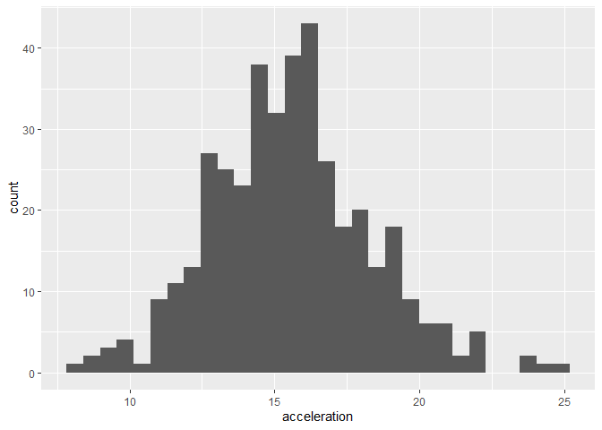

Categorical variables
---------------------

``` r
ggplot(data =data.auto) + geom_bar(aes(x= cylinders))
```

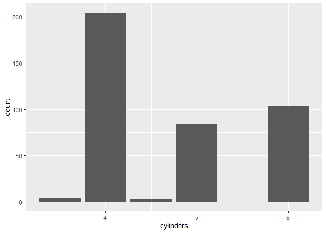

``` r
table(cylinders)
```

    ## cylinders
    ## 3cyl 4cyl 5cyl 6cyl 8cyl 
    ##    4  204    3   84  103

Scatterplots
------------

``` r
g = ggplot(data.auto, aes(x=mpg, y =weight)) + geom_point()
g + ggtitle('Scatter plot') + xlab('Miles/US Galon') + ylab('Weight of the vehicle per 1000lbs')
```


Boxplots
--------

``` r
ggplot(data.auto, aes(x= factor(cylinders), y= mpg)) + geom_boxplot()
```

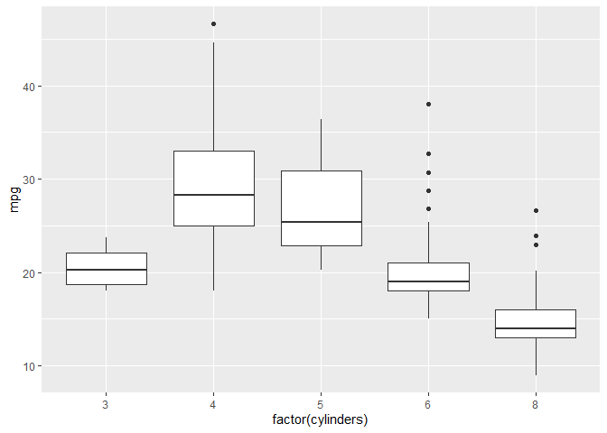

Violin plots
------------

``` r
ggplot(data.auto, aes(x=factor(cylinders), y =weight)) + geom_point() + geom_violin()
```


