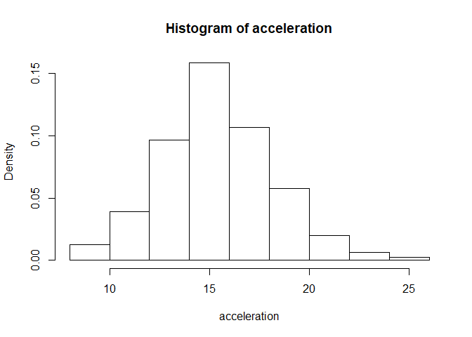
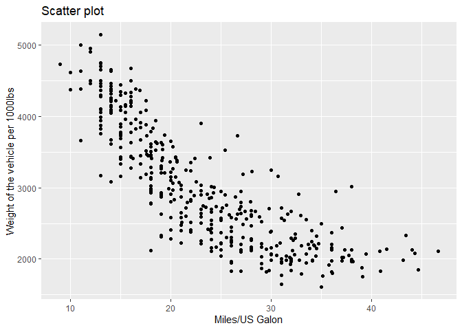
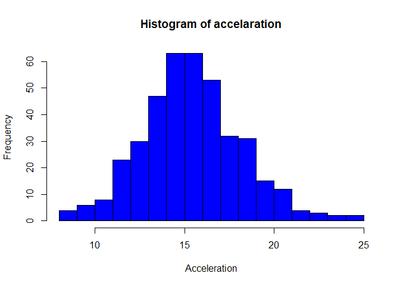
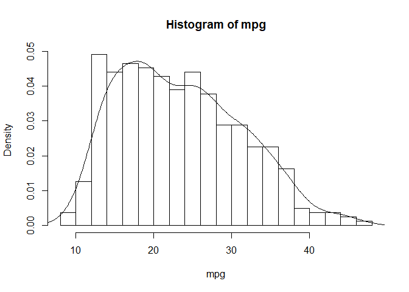

Lab 5: Using the ggplot package.
================

Introduction
------------

R provides excellent graphing capabilities with pacakges such as **lattice** and **ggplot2**.

For more details on using R Markdown see <http://rmarkdown.rstudio.com>. We will briefly describe some simple graphs using base graphics from the previous unit and then show their counterparts in ggplot2.

What is ggplot?
---------------

An R package designed to create plots based on a theory of the grammar of the graphics

Why ggplot instead of base R?
-----------------------------

-   nice defaults

-   easy faceting

-   more natural syntax

-   can switch chart types more easily

Reading and checking the structure of the dataset
-------------------------------------------------

``` r
data.auto = read.csv('../Labs/data/auto-mpg.csv')
head(data.auto)
```

    ##   No mpg cylinders displacement horsepower weight acceleration model_year
    ## 1  1  28         4          140         90   2264         15.5         71
    ## 2  2  19         3           70         97   2330         13.5         72
    ## 3  3  36         4          107         75   2205         14.5         82
    ## 4  4  28         4           97         92   2288         17.0         72
    ## 5  5  21         6          199         90   2648         15.0         70
    ## 6  6  23         4          115         95   2694         15.0         75
    ##              car_name
    ## 1 chevrolet vega 2300
    ## 2     mazda rx2 coupe
    ## 3        honda accord
    ## 4     datsun 510 (sw)
    ## 5         amc gremlin
    ## 6          audi 100ls

``` r
attach(data.auto)
```

ggplot syntax
-------------

The basic structure for ggplot2 starts up with the **ggplot** function. It can take additional arguments or fewer but we will stick with that for the time being.

In addition to this, we add layers (options) with the plus sign. We will discuss geometric layers with points, or lines with the following functions

1.  geom\_point ()
2.  geom\_line ()
3.  geom\_histogram ()

Histograms and densities with ggplot2
-------------------------------------

We will plot the distribution of acceleration using ggplot2.

``` r
library(ggplot2)
```

    ## 
    ## Attaching package: 'ggplot2'

    ## The following object is masked from 'data.auto':
    ## 
    ##     mpg

``` r
ggplot(data = data.auto) + geom_histogram(aes(x= acceleration))
```

    ## `stat_bin()` using `bins = 30`. Pick better value with `binwidth`.


Categorical variables
---------------------

``` r
ggplot(data =data.auto) + geom_bar(aes(x= cylinders))
```



``` r
table(cylinders)
```

    ## cylinders
    ##   3   4   5   6   8 
    ##   4 204   3  84 103

Scatterplots
------------

``` r
g = ggplot(data.auto, aes(x=mpg, y =weight)) + geom_point()
g + ggtitle('Scatter plot') + xlab('Miles/US Galon') + ylab('Weight of the vehicle per 1000lbs')
```



Boxplots
--------

``` r
ggplot(data.auto, aes(x= factor(cylinders), y= mpg)) + geom_boxplot()
```



Violin plots
------------

``` r
ggplot(data.auto, aes(x=factor(cylinders), y =weight)) + geom_point() + geom_violin()
```


