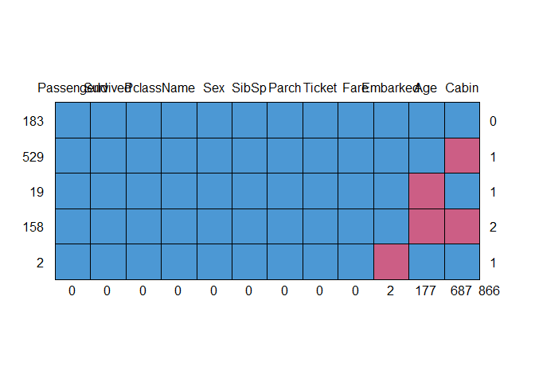
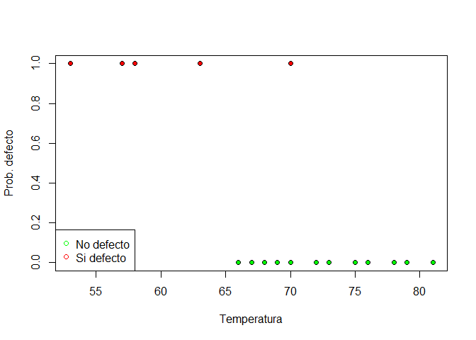

Lab 6: Logistic Regression. Economic Analysis with R
================

Introduction
------------

-   Logistic regression or logit model is employed to model dichotomous outcome variable (dependent variable).
-   It is also a very popular classification algorithm in machine learning.

-   At the end of this unit, students will be able to:

    -   know what does exactly logistic regression
    -   become familiar with the syntax of R logistic regression
    -   apply the logit model in different contexts

Applications of logistic regression
===================================

-   Health care analysis
-   Geographic image processing
-   To make predictions about something we employ logistic regression

Basic syntax
------------

-   It is quite similar to regression models using the lm () command. We employ the *glm ()* function that has the following basic arguments

-   The formula indicates the relationship between variables. The dataset is the dataframe containing the information of the variables, and the family is the R object to specify the details of the model. In the case of logistic regression, its value is binomial.

Performance of the logistic regression
======================================

-   We need to test the performance of our model by using different metrics.
-   Akaike criteria
-   Null deviance
-   Confusion matrix

Titanic dataset
===============

We will be using the Titanic dataset from Kaggle. Let us try to download it, and summarize the dataset

``` r
fitting.data.raw = read.csv("../Labs/data/train.csv", header = TRUE, na.strings = c(''))
str(fitting.data.raw)
```

    ## 'data.frame':    891 obs. of  12 variables:
    ##  $ PassengerId: int  1 2 3 4 5 6 7 8 9 10 ...
    ##  $ Survived   : int  0 1 1 1 0 0 0 0 1 1 ...
    ##  $ Pclass     : int  3 1 3 1 3 3 1 3 3 2 ...
    ##  $ Name       : Factor w/ 891 levels "Abbing, Mr. Anthony",..: 109 191 358 277 16 559 520 629 417 581 ...
    ##  $ Sex        : Factor w/ 2 levels "female","male": 2 1 1 1 2 2 2 2 1 1 ...
    ##  $ Age        : num  22 38 26 35 35 NA 54 2 27 14 ...
    ##  $ SibSp      : int  1 1 0 1 0 0 0 3 0 1 ...
    ##  $ Parch      : int  0 0 0 0 0 0 0 1 2 0 ...
    ##  $ Ticket     : Factor w/ 681 levels "110152","110413",..: 524 597 670 50 473 276 86 396 345 133 ...
    ##  $ Fare       : num  7.25 71.28 7.92 53.1 8.05 ...
    ##  $ Cabin      : Factor w/ 147 levels "A10","A14","A16",..: NA 82 NA 56 NA NA 130 NA NA NA ...
    ##  $ Embarked   : Factor w/ 3 levels "C","Q","S": 3 1 3 3 3 2 3 3 3 1 ...

``` r
summary(fitting.data.raw)
```

    ##   PassengerId       Survived          Pclass     
    ##  Min.   :  1.0   Min.   :0.0000   Min.   :1.000  
    ##  1st Qu.:223.5   1st Qu.:0.0000   1st Qu.:2.000  
    ##  Median :446.0   Median :0.0000   Median :3.000  
    ##  Mean   :446.0   Mean   :0.3838   Mean   :2.309  
    ##  3rd Qu.:668.5   3rd Qu.:1.0000   3rd Qu.:3.000  
    ##  Max.   :891.0   Max.   :1.0000   Max.   :3.000  
    ##                                                  
    ##                                     Name         Sex           Age       
    ##  Abbing, Mr. Anthony                  :  1   female:314   Min.   : 0.42  
    ##  Abbott, Mr. Rossmore Edward          :  1   male  :577   1st Qu.:20.12  
    ##  Abbott, Mrs. Stanton (Rosa Hunt)     :  1                Median :28.00  
    ##  Abelson, Mr. Samuel                  :  1                Mean   :29.70  
    ##  Abelson, Mrs. Samuel (Hannah Wizosky):  1                3rd Qu.:38.00  
    ##  Adahl, Mr. Mauritz Nils Martin       :  1                Max.   :80.00  
    ##  (Other)                              :885                NA's   :177    
    ##      SibSp           Parch             Ticket         Fare       
    ##  Min.   :0.000   Min.   :0.0000   1601    :  7   Min.   :  0.00  
    ##  1st Qu.:0.000   1st Qu.:0.0000   347082  :  7   1st Qu.:  7.91  
    ##  Median :0.000   Median :0.0000   CA. 2343:  7   Median : 14.45  
    ##  Mean   :0.523   Mean   :0.3816   3101295 :  6   Mean   : 32.20  
    ##  3rd Qu.:1.000   3rd Qu.:0.0000   347088  :  6   3rd Qu.: 31.00  
    ##  Max.   :8.000   Max.   :6.0000   CA 2144 :  6   Max.   :512.33  
    ##                                   (Other) :852                   
    ##          Cabin     Embarked  
    ##  B96 B98    :  4   C   :168  
    ##  C23 C25 C27:  4   Q   : 77  
    ##  G6         :  4   S   :644  
    ##  C22 C26    :  3   NA's:  2  
    ##  D          :  3             
    ##  (Other)    :186             
    ##  NA's       :687

Missing values treatment
------------------------

``` r
install.packages('mice', repos='http://cran.us.r-project.org')
```

    ## Installing package into 'C:/Users/anton/OneDrive/Documentos/R/win-library/3.6'
    ## (as 'lib' is unspecified)

    ## package 'mice' successfully unpacked and MD5 sums checked
    ## 
    ## The downloaded binary packages are in
    ##  C:\Users\anton\AppData\Local\Temp\RtmpMzmJVL\downloaded_packages

``` r
library(mice)
```

    ## Warning: package 'mice' was built under R version 3.6.1

    ## Loading required package: lattice

    ## 
    ## Attaching package: 'mice'

    ## The following objects are masked from 'package:base':
    ## 
    ##     cbind, rbind

Pattern of missing values
-------------------------

``` r
md.pattern(fitting.data.raw)
```



    ##     PassengerId Survived Pclass Name Sex SibSp Parch Ticket Fare Embarked
    ## 183           1        1      1    1   1     1     1      1    1        1
    ## 529           1        1      1    1   1     1     1      1    1        1
    ## 19            1        1      1    1   1     1     1      1    1        1
    ## 158           1        1      1    1   1     1     1      1    1        1
    ## 2             1        1      1    1   1     1     1      1    1        0
    ##               0        0      0    0   0     0     0      0    0        2
    ##     Age Cabin    
    ## 183   1     1   0
    ## 529   1     0   1
    ## 19    0     1   1
    ## 158   0     0   2
    ## 2     1     1   1
    ##     177   687 866

Visualizing missing values
--------------------------

``` r
install.packages('VIM',repos='http://cran.us.r-project.org')
```

    ## Installing package into 'C:/Users/anton/OneDrive/Documentos/R/win-library/3.6'
    ## (as 'lib' is unspecified)

    ## package 'VIM' successfully unpacked and MD5 sums checked
    ## 
    ## The downloaded binary packages are in
    ##  C:\Users\anton\AppData\Local\Temp\RtmpMzmJVL\downloaded_packages

``` r
library(VIM)
```

    ## Warning: package 'VIM' was built under R version 3.6.1

    ## Loading required package: colorspace

    ## Loading required package: grid

    ## Loading required package: data.table

    ## Registered S3 methods overwritten by 'car':
    ##   method                          from
    ##   influence.merMod                lme4
    ##   cooks.distance.influence.merMod lme4
    ##   dfbeta.influence.merMod         lme4
    ##   dfbetas.influence.merMod        lme4

    ## VIM is ready to use. 
    ##  Since version 4.0.0 the GUI is in its own package VIMGUI.
    ## 
    ##           Please use the package to use the new (and old) GUI.

    ## Suggestions and bug-reports can be submitted at: https://github.com/alexkowa/VIM/issues

    ## 
    ## Attaching package: 'VIM'

    ## The following object is masked from 'package:datasets':
    ## 
    ##     sleep

Graphical analysis
------------------

``` r
aggr_titanic = aggr(fitting.data.raw, col = mdc(1:2), numbers = TRUE, sortVars = TRUE)
```


    ## 
    ##  Variables sorted by number of missings: 
    ##     Variable       Count
    ##        Cabin 0.771043771
    ##          Age 0.198653199
    ##     Embarked 0.002244669
    ##  PassengerId 0.000000000
    ##     Survived 0.000000000
    ##       Pclass 0.000000000
    ##         Name 0.000000000
    ##          Sex 0.000000000
    ##        SibSp 0.000000000
    ##        Parch 0.000000000
    ##       Ticket 0.000000000
    ##         Fare 0.000000000

Subset, drop variables with lots of missing values, it can be imputed
---------------------------------------------------------------------

``` r
fitting.data.raw.copy1 = subset(fitting.data.raw, select = c(2, 3,5, 6, 7, 8, 10, 12))
str(fitting.data.raw.copy1)
```

    ## 'data.frame':    891 obs. of  8 variables:
    ##  $ Survived: int  0 1 1 1 0 0 0 0 1 1 ...
    ##  $ Pclass  : int  3 1 3 1 3 3 1 3 3 2 ...
    ##  $ Sex     : Factor w/ 2 levels "female","male": 2 1 1 1 2 2 2 2 1 1 ...
    ##  $ Age     : num  22 38 26 35 35 NA 54 2 27 14 ...
    ##  $ SibSp   : int  1 1 0 1 0 0 0 3 0 1 ...
    ##  $ Parch   : int  0 0 0 0 0 0 0 1 2 0 ...
    ##  $ Fare    : num  7.25 71.28 7.92 53.1 8.05 ...
    ##  $ Embarked: Factor w/ 3 levels "C","Q","S": 3 1 3 3 3 2 3 3 3 1 ...

Alternativaley, with the column number or column names.

``` r
fitting.data.raw.copy2 = fitting.data.raw[,c(2,3,5,6,7,8, 10, 12)]
str(fitting.data.raw.copy2)
```

    ## 'data.frame':    891 obs. of  8 variables:
    ##  $ Survived: int  0 1 1 1 0 0 0 0 1 1 ...
    ##  $ Pclass  : int  3 1 3 1 3 3 1 3 3 2 ...
    ##  $ Sex     : Factor w/ 2 levels "female","male": 2 1 1 1 2 2 2 2 1 1 ...
    ##  $ Age     : num  22 38 26 35 35 NA 54 2 27 14 ...
    ##  $ SibSp   : int  1 1 0 1 0 0 0 3 0 1 ...
    ##  $ Parch   : int  0 0 0 0 0 0 0 1 2 0 ...
    ##  $ Fare    : num  7.25 71.28 7.92 53.1 8.05 ...
    ##  $ Embarked: Factor w/ 3 levels "C","Q","S": 3 1 3 3 3 2 3 3 3 1 ...

Imputed missing values for Age with the mean
--------------------------------------------

``` r
install.packages('Hmisc',repos='http://cran.us.r-project.org')
```

    ## Installing package into 'C:/Users/anton/OneDrive/Documentos/R/win-library/3.6'
    ## (as 'lib' is unspecified)

    ## package 'Hmisc' successfully unpacked and MD5 sums checked
    ## 
    ## The downloaded binary packages are in
    ##  C:\Users\anton\AppData\Local\Temp\RtmpMzmJVL\downloaded_packages

``` r
library(Hmisc)
```

    ## Warning: package 'Hmisc' was built under R version 3.6.1

    ## Loading required package: survival

    ## Loading required package: Formula

    ## Loading required package: ggplot2

    ## Warning: package 'ggplot2' was built under R version 3.6.1

    ## 
    ## Attaching package: 'Hmisc'

    ## The following objects are masked from 'package:base':
    ## 
    ##     format.pval, units

``` r
fitting.data.raw.copy1$Age = impute(fitting.data.raw.copy1$Age, mean)
summary(fitting.data.raw.copy1)
```

    ## 
    ##  177 values imputed to 29.69912

    ##     Survived          Pclass          Sex           Age       
    ##  Min.   :0.0000   Min.   :1.000   female:314   Min.   : 0.42  
    ##  1st Qu.:0.0000   1st Qu.:2.000   male  :577   1st Qu.:22.00  
    ##  Median :0.0000   Median :3.000                Median :29.70  
    ##  Mean   :0.3838   Mean   :2.309                Mean   :29.70  
    ##  3rd Qu.:1.0000   3rd Qu.:3.000                3rd Qu.:35.00  
    ##  Max.   :1.0000   Max.   :3.000                Max.   :80.00  
    ##      SibSp           Parch             Fare        Embarked  
    ##  Min.   :0.000   Min.   :0.0000   Min.   :  0.00   C   :168  
    ##  1st Qu.:0.000   1st Qu.:0.0000   1st Qu.:  7.91   Q   : 77  
    ##  Median :0.000   Median :0.0000   Median : 14.45   S   :644  
    ##  Mean   :0.523   Mean   :0.3816   Mean   : 32.20   NA's:  2  
    ##  3rd Qu.:1.000   3rd Qu.:0.0000   3rd Qu.: 31.00             
    ##  Max.   :8.000   Max.   :6.0000   Max.   :512.33

Categorical variables ( factors in R: sex, and embarked)
--------------------------------------------------------

``` r
sapply(fitting.data.raw.copy1, class)
```

    ##  Survived    Pclass       Sex       Age     SibSp     Parch      Fare 
    ## "integer" "integer"  "factor"  "impute" "integer" "integer" "numeric" 
    ##  Embarked 
    ##  "factor"

Remove NAs for one variable (Embarked)
--------------------------------------

``` r
fitting.data.raw.copy1 = fitting.data.raw.copy1[!is.na(fitting.data.raw.copy1$Embarked),]
summary(fitting.data.raw.copy1)
```

    ## 
    ##  177 values imputed to 29.69912

    ##     Survived          Pclass          Sex           Age       
    ##  Min.   :0.0000   Min.   :1.000   female:312   Min.   : 0.42  
    ##  1st Qu.:0.0000   1st Qu.:2.000   male  :577   1st Qu.:22.00  
    ##  Median :0.0000   Median :3.000                Median :29.70  
    ##  Mean   :0.3825   Mean   :2.312                Mean   :29.65  
    ##  3rd Qu.:1.0000   3rd Qu.:3.000                3rd Qu.:35.00  
    ##  Max.   :1.0000   Max.   :3.000                Max.   :80.00  
    ##      SibSp            Parch             Fare         Embarked
    ##  Min.   :0.0000   Min.   :0.0000   Min.   :  0.000   C:168   
    ##  1st Qu.:0.0000   1st Qu.:0.0000   1st Qu.:  7.896   Q: 77   
    ##  Median :0.0000   Median :0.0000   Median : 14.454   S:644   
    ##  Mean   :0.5242   Mean   :0.3825   Mean   : 32.097           
    ##  3rd Qu.:1.0000   3rd Qu.:0.0000   3rd Qu.: 31.000           
    ##  Max.   :8.0000   Max.   :6.0000   Max.   :512.329

Practical example
=================

``` r
# load the dataset and create a small dataframe
temperatura <-c(66,70,69,68,67,72,73,70,57,63,70,78,67,53,67,75,70,81,76,79,75,76,58)
defecto <-c( 0, 0, 0, 0, 0, 0, 0, 0, 1, 1, 1, 0, 0, 1, 0, 0, 0, 0, 0, 0, 0, 0, 1)
aux <-matrix(c(temperatura,defecto),ncol = 2)
colnames(aux) <- c('temperatura','defecto')
datos<-data.frame(aux)
```

``` r
# Question. Count the number of correct/wrong

table(datos$defecto)
```

    ## 
    ##  0  1 
    ## 18  5

``` r
round(prop.table(table(datos$defecto)), 2)
```

    ## 
    ##    0    1 
    ## 0.78 0.22

``` r
# Graphical representation
colores <- NULL
colores[datos$defecto == 0] <- "green"
colores[datos$defecto == 1] <- "red"
plot(datos$temperatura, datos$defecto, pch = 21, bg = colores, xlab = "Temperatura", ylab = "Prob. defecto")
legend("bottomleft", c("No defecto", "Si defecto"), pch = 21, col = c("green", "red"))
```



``` r
# Estimate a logistic regression model where the dependent variable is defecto and the explanatory variable is the temperature
reg <- glm(defecto ~ temperatura, data = datos, family = binomial)
summary(reg)
```

    ## 
    ## Call:
    ## glm(formula = defecto ~ temperatura, family = binomial, data = datos)
    ## 
    ## Deviance Residuals: 
    ##      Min        1Q    Median        3Q       Max  
    ## -0.84513  -0.38010  -0.09632  -0.02831   2.41364  
    ## 
    ## Coefficients:
    ##             Estimate Std. Error z value Pr(>|z|)  
    ## (Intercept)  32.3381    17.6301   1.834   0.0666 .
    ## temperatura  -0.5028     0.2643  -1.902   0.0571 .
    ## ---
    ## Signif. codes:  0 '***' 0.001 '**' 0.01 '*' 0.05 '.' 0.1 ' ' 1
    ## 
    ## (Dispersion parameter for binomial family taken to be 1)
    ## 
    ##     Null deviance: 24.0850  on 22  degrees of freedom
    ## Residual deviance:  9.8032  on 21  degrees of freedom
    ## AIC: 13.803
    ## 
    ## Number of Fisher Scoring iterations: 7

References
==========

\*R for everyone: Advanced Analytics and Graphics. Chapter 20. Generalized linear models. Logistic regression. Addison Wesley Data & Analytics Series.
