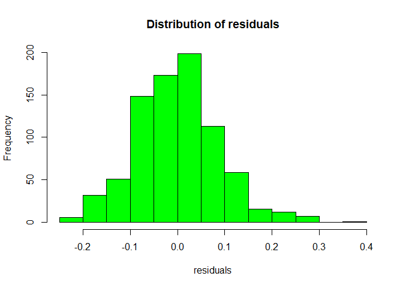

Lab 8 : Introduction to panel data models
================

Introduction
------------

The purpose of this in-class lab is to use R to practice with linear panel data models. For that purpose, we will be using the `plm`package dveloped by .

Panel data models
-----------------

### Static Panel data models

In a panel data setting, we could specify our model as follows:

-   where *y*<sub>*i**t*</sub> is the dependent variable for individual *i* in period *t*, and *x*<sub>*i**t*</sub> is a vector of control variables that are expected to influence *y*<sub>*i**t*</sub>. *α*<sub>*i*</sub> is the individual effect, and *v*<sub>*i**t*</sub> is the classical error term.

-   The *α*<sub>*i*</sub> captures the effects of variables which vary across individuals but are constant over time. The equation (1) can be estimated by using Ordinary Least Squares (OLS) neglecting the individual heterogeneity across individuals.

For starters
------------

You might need to install the `plm` package and Open up a new R script (named `ICL13_XYZ.R`, where `XYZ` are your initials) and add the usual "preamble" to the top:

``` r
library(tidyverse)
```

    ## Warning: package 'tidyverse' was built under R version 3.6.1

    ## Warning: package 'ggplot2' was built under R version 3.6.1

    ## Warning: package 'tibble' was built under R version 3.6.1

    ## Warning: package 'dplyr' was built under R version 3.6.1

``` r
library(broom)
library(plm) # This is an old version, now it is possible to generate tibbles with panelr
```

    ## Warning: package 'plm' was built under R version 3.6.1

``` r
library(funModeling)
```

    ## Warning: package 'funModeling' was built under R version 3.6.1

    ## Warning: package 'Hmisc' was built under R version 3.6.1

### Load the data

We're going to use Grunfeld data (macro panel).

Data description
================

``` r
library(dynpanel)
?Produc
```

    ## starting httpd help server ... done

``` r
df_status(Produc) # Looking at the amount of zeros or missing values using funModeling package
```

    ##    variable q_zeros p_zeros q_na p_na q_inf p_inf    type unique
    ## 1     state       0       0    0    0     0     0  factor     48
    ## 2      year       0       0    0    0     0     0 integer     17
    ## 3      pcap       0       0    0    0     0     0 numeric    815
    ## 4       hwy       0       0    0    0     0     0 numeric    816
    ## 5     water       0       0    0    0     0     0 numeric    815
    ## 6      util       0       0    0    0     0     0 numeric    816
    ## 7        pc       0       0    0    0     0     0 numeric    816
    ## 8       gsp       0       0    0    0     0     0 integer    807
    ## 9       emp       0       0    0    0     0     0 numeric    807
    ## 10    unemp       0       0    0    0     0     0 numeric     80

``` r
pdim(Produc, index = c("state", "year"))
```

    ## Balanced Panel: n = 48, T = 17, N = 816

``` r
dim(table(Produc$state,Produc$year))
```

    ## [1] 48 17

Pooled OLS
==========

``` r
#Ignoring the panel data structure. We run a pooled OLS model on the data
reg = lm(log(gsp) ~ log(pcap) + log(pc)+ log(emp) +unemp, data = Produc)
summary(reg)
```

    ## 
    ## Call:
    ## lm(formula = log(gsp) ~ log(pcap) + log(pc) + log(emp) + unemp, 
    ##     data = Produc)
    ## 
    ## Residuals:
    ##      Min       1Q   Median       3Q      Max 
    ## -0.23176 -0.06104 -0.00010  0.05085  0.35111 
    ## 
    ## Coefficients:
    ##              Estimate Std. Error t value Pr(>|t|)    
    ## (Intercept)  1.643302   0.057587  28.536  < 2e-16 ***
    ## log(pcap)    0.155007   0.017154   9.036  < 2e-16 ***
    ## log(pc)      0.309190   0.010272  30.100  < 2e-16 ***
    ## log(emp)     0.593935   0.013747  43.203  < 2e-16 ***
    ## unemp       -0.006733   0.001416  -4.754 2.36e-06 ***
    ## ---
    ## Signif. codes:  0 '***' 0.001 '**' 0.01 '*' 0.05 '.' 0.1 ' ' 1
    ## 
    ## Residual standard error: 0.0881 on 811 degrees of freedom
    ## Multiple R-squared:  0.9926, Adjusted R-squared:  0.9926 
    ## F-statistic: 2.717e+04 on 4 and 811 DF,  p-value: < 2.2e-16

``` r
hist(reg$residuals, col = "green",
     xlab = 'residuals', main ='Distribution of residuals')
```



Fixed effects model (FE)
========================

-   A fixed effects model is estimated by running OLS on the transformed model (within transformation). We can also inspect the fixed effects model with the summary function

``` r
pmodel2 <- plm(log(gsp) ~ log(pcap) + log(pc) + log(emp) + unemp, data=Produc,  effect = 'twoways', index=c("state", "year"),model="within")
summary(pmodel2)
```

    ## Twoways effects Within Model
    ## 
    ## Call:
    ## plm(formula = log(gsp) ~ log(pcap) + log(pc) + log(emp) + unemp, 
    ##     data = Produc, effect = "twoways", model = "within", index = c("state", 
    ##         "year"))
    ## 
    ## Balanced Panel: n = 48, T = 17, N = 816
    ## 
    ## Residuals:
    ##        Min.     1st Qu.      Median     3rd Qu.        Max. 
    ## -0.16036887 -0.01802634 -0.00085879  0.01674472  0.17075163 
    ## 
    ## Coefficients:
    ##             Estimate Std. Error t-value  Pr(>|t|)    
    ## log(pcap) -0.0301761  0.0269365 -1.1203 0.2629606    
    ## log(pc)    0.1688280  0.0276563  6.1045 1.655e-09 ***
    ## log(emp)   0.7693062  0.0281418 27.3368 < 2.2e-16 ***
    ## unemp     -0.0042211  0.0011388 -3.7065 0.0002257 ***
    ## ---
    ## Signif. codes:  0 '***' 0.001 '**' 0.01 '*' 0.05 '.' 0.1 ' ' 1
    ## 
    ## Total Sum of Squares:    3.5889
    ## Residual Sum of Squares: 0.87944
    ## R-Squared:      0.75496
    ## Adj. R-Squared: 0.73301
    ## F-statistic: 576.134 on 4 and 748 DF, p-value: < 2.22e-16

Note that the FE model can be estimated by only using time invariant effects
============================================================================

``` r
pmodel21 <- plm(log(gsp) ~ log(pcap) + log(pc) + log(emp) + unemp, data=Produc, effect = 'individual',index=c("state"),model="within")
summary(pmodel21)
```

    ## Oneway (individual) effect Within Model
    ## 
    ## Call:
    ## plm(formula = log(gsp) ~ log(pcap) + log(pc) + log(emp) + unemp, 
    ##     data = Produc, effect = "individual", model = "within", index = c("state"))
    ## 
    ## Balanced Panel: n = 48, T = 17, N = 816
    ## 
    ## Residuals:
    ##      Min.   1st Qu.    Median   3rd Qu.      Max. 
    ## -0.120456 -0.023741 -0.002041  0.018144  0.174718 
    ## 
    ## Coefficients:
    ##              Estimate  Std. Error t-value  Pr(>|t|)    
    ## log(pcap) -0.02614965  0.02900158 -0.9017    0.3675    
    ## log(pc)    0.29200693  0.02511967 11.6246 < 2.2e-16 ***
    ## log(emp)   0.76815947  0.03009174 25.5273 < 2.2e-16 ***
    ## unemp     -0.00529774  0.00098873 -5.3582 1.114e-07 ***
    ## ---
    ## Signif. codes:  0 '***' 0.001 '**' 0.01 '*' 0.05 '.' 0.1 ' ' 1
    ## 
    ## Total Sum of Squares:    18.941
    ## Residual Sum of Squares: 1.1112
    ## R-Squared:      0.94134
    ## Adj. R-Squared: 0.93742
    ## F-statistic: 3064.81 on 4 and 764 DF, p-value: < 2.22e-16

``` r
# Another way using individual dummies with the lm function, and factor to generate categorical variables

panel_ols <-lm(log(gsp) ~ log(pcap) + log(pc) + log(emp) + unemp + as.factor(state), data=Produc)
summary(panel_ols)
```

    ## 
    ## Call:
    ## lm(formula = log(gsp) ~ log(pcap) + log(pc) + log(emp) + unemp + 
    ##     as.factor(state), data = Produc)
    ## 
    ## Residuals:
    ##       Min        1Q    Median        3Q       Max 
    ## -0.120456 -0.023741 -0.002041  0.018144  0.174718 
    ## 
    ## Coefficients:
    ##                                  Estimate Std. Error t value Pr(>|t|)    
    ## (Intercept)                     2.2016171  0.1760039  12.509  < 2e-16 ***
    ## log(pcap)                      -0.0261497  0.0290016  -0.902 0.367520    
    ## log(pc)                         0.2920069  0.0251197  11.625  < 2e-16 ***
    ## log(emp)                        0.7681595  0.0300917  25.527  < 2e-16 ***
    ## unemp                          -0.0052977  0.0009887  -5.358 1.11e-07 ***
    ## as.factor(state)ARIZONA         0.1664711  0.0136339  12.210  < 2e-16 ***
    ## as.factor(state)ARKANSAS        0.0613987  0.0167200   3.672 0.000257 ***
    ## as.factor(state)CALIFORNIA      0.2988064  0.0368152   8.116 1.92e-15 ***
    ## as.factor(state)COLORADO        0.1942933  0.0137456  14.135  < 2e-16 ***
    ## as.factor(state)CONNECTICUT     0.2695870  0.0188069  14.334  < 2e-16 ***
    ## as.factor(state)DELAWARE        0.2118447  0.0224317   9.444  < 2e-16 ***
    ## as.factor(state)FLORIDA         0.1315365  0.0204890   6.420 2.39e-10 ***
    ## as.factor(state)GEORGIA         0.0565913  0.0160726   3.521 0.000455 ***
    ## as.factor(state)IDAHO           0.1367971  0.0251638   5.436 7.33e-08 ***
    ## as.factor(state)ILLINOIS        0.1857045  0.0240673   7.716 3.75e-14 ***
    ## as.factor(state)INDIANA         0.0577659  0.0140859   4.101 4.56e-05 ***
    ## as.factor(state)IOWA            0.1255468  0.0140015   8.967  < 2e-16 ***
    ## as.factor(state)KANSAS          0.1371022  0.0156361   8.768  < 2e-16 ***
    ## as.factor(state)KENTUCKY        0.1976714  0.0140004  14.119  < 2e-16 ***
    ## as.factor(state)LOUISIANA       0.3130538  0.0221300  14.146  < 2e-16 ***
    ## as.factor(state)MAINE           0.0667994  0.0252355   2.647 0.008287 ** 
    ## as.factor(state)MARYLAND        0.1986626  0.0202528   9.809  < 2e-16 ***
    ## as.factor(state)MASSACHUSETTS   0.1606046  0.0230800   6.959 7.40e-12 ***
    ## as.factor(state)MICHIGAN        0.2153772  0.0216800   9.934  < 2e-16 ***
    ## as.factor(state)MINNESOTA       0.1139325  0.0165492   6.884 1.21e-11 ***
    ## as.factor(state)MISSISSIPPI     0.0484077  0.0142564   3.396 0.000720 ***
    ## as.factor(state)MISSOURI        0.1120075  0.0152631   7.338 5.53e-13 ***
    ## as.factor(state)MONTANA         0.1465372  0.0266613   5.496 5.29e-08 ***
    ## as.factor(state)NEBRASKA        0.1096629  0.0163961   6.688 4.36e-11 ***
    ## as.factor(state)NEVADA          0.1402695  0.0246146   5.699 1.72e-08 ***
    ## as.factor(state)NEW_HAMPSHIRE   0.1225307  0.0273569   4.479 8.65e-06 ***
    ## as.factor(state)NEW_JERSEY      0.2412522  0.0201436  11.977  < 2e-16 ***
    ## as.factor(state)NEW_MEXICO      0.2527582  0.0222681  11.351  < 2e-16 ***
    ## as.factor(state)NEW_YORK        0.2743707  0.0388086   7.070 3.50e-12 ***
    ## as.factor(state)NORTH_CAROLINA  0.0360085  0.0169712   2.122 0.034180 *  
    ## as.factor(state)NORTH_DAKOTA    0.1422779  0.0296689   4.796 1.95e-06 ***
    ## as.factor(state)OHIO            0.1210276  0.0227620   5.317 1.39e-07 ***
    ## as.factor(state)OKLAHOMA        0.2143161  0.0164367  13.039  < 2e-16 ***
    ## as.factor(state)OREGON          0.1492874  0.0139964  10.666  < 2e-16 ***
    ## as.factor(state)PENNSYLVANIA    0.0877258  0.0247990   3.537 0.000428 ***
    ## as.factor(state)RHODE_ISLAND    0.1867342  0.0303340   6.156 1.20e-09 ***
    ## as.factor(state)SOUTH_CAROLINA -0.0822229  0.0168470  -4.881 1.29e-06 ***
    ## as.factor(state)SOUTH_DAKOTA    0.0880634  0.0239972   3.670 0.000260 ***
    ## as.factor(state)TENNESSE        0.0274809  0.0155322   1.769 0.077245 .  
    ## as.factor(state)TEXAS           0.1920419  0.0251718   7.629 7.04e-14 ***
    ## as.factor(state)UTAH            0.1270402  0.0170767   7.439 2.73e-13 ***
    ## as.factor(state)VERMONT         0.1345834  0.0287631   4.679 3.41e-06 ***
    ## as.factor(state)VIRGINIA        0.1788495  0.0182458   9.802  < 2e-16 ***
    ## as.factor(state)WASHINGTON      0.2451646  0.0205819  11.912  < 2e-16 ***
    ## as.factor(state)WEST_VIRGINIA   0.0915331  0.0182785   5.008 6.85e-07 ***
    ## as.factor(state)WISCONSIN       0.1273428  0.0170359   7.475 2.12e-13 ***
    ## as.factor(state)WYOMING         0.4469400  0.0398907  11.204  < 2e-16 ***
    ## ---
    ## Signif. codes:  0 '***' 0.001 '**' 0.01 '*' 0.05 '.' 0.1 ' ' 1
    ## 
    ## Residual standard error: 0.03814 on 764 degrees of freedom
    ## Multiple R-squared:  0.9987, Adjusted R-squared:  0.9986 
    ## F-statistic: 1.144e+04 on 51 and 764 DF,  p-value: < 2.2e-16

``` r
# Using the lm package
library(lmtest)
```

    ## Warning: package 'lmtest' was built under R version 3.6.1

    ## Loading required package: zoo

    ## Warning: package 'zoo' was built under R version 3.6.1

    ## 
    ## Attaching package: 'zoo'

    ## The following objects are masked from 'package:base':
    ## 
    ##     as.Date, as.Date.numeric

``` r
coeftest(panel_ols, vcov = vcovHC, type = "HC1")
```

    ## 
    ## t test of coefficients:
    ## 
    ##                                  Estimate Std. Error t value  Pr(>|t|)    
    ## (Intercept)                     2.2016171  0.1734075 12.6962 < 2.2e-16 ***
    ## log(pcap)                      -0.0261497  0.0322935 -0.8097 0.4183367    
    ## log(pc)                         0.2920069  0.0315250  9.2627 < 2.2e-16 ***
    ## log(emp)                        0.7681595  0.0411798 18.6538 < 2.2e-16 ***
    ## unemp                          -0.0052977  0.0011294 -4.6908 3.224e-06 ***
    ## as.factor(state)ARIZONA         0.1664711  0.0114472 14.5425 < 2.2e-16 ***
    ## as.factor(state)ARKANSAS        0.0613987  0.0167648  3.6624 0.0002671 ***
    ## as.factor(state)CALIFORNIA      0.2988064  0.0362807  8.2360 7.703e-16 ***
    ## as.factor(state)COLORADO        0.1942933  0.0119492 16.2599 < 2.2e-16 ***
    ## as.factor(state)CONNECTICUT     0.2695870  0.0219994 12.2543 < 2.2e-16 ***
    ## as.factor(state)DELAWARE        0.2118447  0.0239758  8.8358 < 2.2e-16 ***
    ## as.factor(state)FLORIDA         0.1315365  0.0210427  6.2509 6.780e-10 ***
    ## as.factor(state)GEORGIA         0.0565913  0.0170702  3.3152 0.0009590 ***
    ## as.factor(state)IDAHO           0.1367971  0.0244153  5.6029 2.943e-08 ***
    ## as.factor(state)ILLINOIS        0.1857045  0.0235343  7.8908 1.040e-14 ***
    ## as.factor(state)INDIANA         0.0577659  0.0129819  4.4497 9.876e-06 ***
    ## as.factor(state)IOWA            0.1255468  0.0146899  8.5465 < 2.2e-16 ***
    ## as.factor(state)KANSAS          0.1371022  0.0183041  7.4902 1.901e-13 ***
    ## as.factor(state)KENTUCKY        0.1976714  0.0120717 16.3748 < 2.2e-16 ***
    ## as.factor(state)LOUISIANA       0.3130538  0.0262122 11.9431 < 2.2e-16 ***
    ## as.factor(state)MAINE           0.0667994  0.0251138  2.6599 0.0079809 ** 
    ## as.factor(state)MARYLAND        0.1986626  0.0204478  9.7156 < 2.2e-16 ***
    ## as.factor(state)MASSACHUSETTS   0.1606046  0.0277761  5.7821 1.075e-08 ***
    ## as.factor(state)MICHIGAN        0.2153772  0.0213738 10.0767 < 2.2e-16 ***
    ## as.factor(state)MINNESOTA       0.1139325  0.0163554  6.9660 7.039e-12 ***
    ## as.factor(state)MISSISSIPPI     0.0484077  0.0154912  3.1249 0.0018462 ** 
    ## as.factor(state)MISSOURI        0.1120075  0.0149671  7.4836 1.993e-13 ***
    ## as.factor(state)MONTANA         0.1465372  0.0320118  4.5776 5.489e-06 ***
    ## as.factor(state)NEBRASKA        0.1096629  0.0183153  5.9875 3.277e-09 ***
    ## as.factor(state)NEVADA          0.1402695  0.0239886  5.8474 7.400e-09 ***
    ## as.factor(state)NEW_HAMPSHIRE   0.1225307  0.0308239  3.9752 7.699e-05 ***
    ## as.factor(state)NEW_JERSEY      0.2412522  0.0227515 10.6038 < 2.2e-16 ***
    ## as.factor(state)NEW_MEXICO      0.2527582  0.0237046 10.6628 < 2.2e-16 ***
    ## as.factor(state)NEW_YORK        0.2743707  0.0387384  7.0826 3.213e-12 ***
    ## as.factor(state)NORTH_CAROLINA  0.0360085  0.0192375  1.8718 0.0616183 .  
    ## as.factor(state)NORTH_DAKOTA    0.1422779  0.0371839  3.8263 0.0001407 ***
    ## as.factor(state)OHIO            0.1210276  0.0229664  5.2698 1.779e-07 ***
    ## as.factor(state)OKLAHOMA        0.2143161  0.0190682 11.2395 < 2.2e-16 ***
    ## as.factor(state)OREGON          0.1492874  0.0120323 12.4072 < 2.2e-16 ***
    ## as.factor(state)PENNSYLVANIA    0.0877258  0.0248599  3.5288 0.0004424 ***
    ## as.factor(state)RHODE_ISLAND    0.1867342  0.0316082  5.9078 5.219e-09 ***
    ## as.factor(state)SOUTH_CAROLINA -0.0822229  0.0196270 -4.1893 3.125e-05 ***
    ## as.factor(state)SOUTH_DAKOTA    0.0880634  0.0278105  3.1666 0.0016039 ** 
    ## as.factor(state)TENNESSE        0.0274809  0.0192362  1.4286 0.1535257    
    ## as.factor(state)TEXAS           0.1920419  0.0238879  8.0393 3.432e-15 ***
    ## as.factor(state)UTAH            0.1270402  0.0159760  7.9519 6.604e-15 ***
    ## as.factor(state)VERMONT         0.1345834  0.0278472  4.8329 1.627e-06 ***
    ## as.factor(state)VIRGINIA        0.1788495  0.0179335  9.9729 < 2.2e-16 ***
    ## as.factor(state)WASHINGTON      0.2451646  0.0196488 12.4774 < 2.2e-16 ***
    ## as.factor(state)WEST_VIRGINIA   0.0915331  0.0193699  4.7255 2.732e-06 ***
    ## as.factor(state)WISCONSIN       0.1273428  0.0176692  7.2070 1.375e-12 ***
    ## as.factor(state)WYOMING         0.4469400  0.0493269  9.0608 < 2.2e-16 ***
    ## ---
    ## Signif. codes:  0 '***' 0.001 '**' 0.01 '*' 0.05 '.' 0.1 ' ' 1

-   save your FE estimates

``` r
fixef(pmodel2)
```

    ##        ALABAMA        ARIZONA       ARKANSAS     CALIFORNIA       COLORADO 
    ##       3.556177       3.669251       3.540236       4.056384       3.712813 
    ##    CONNECTICUT       DELAWARE        FLORIDA        GEORGIA          IDAHO 
    ##       3.766282       3.542745       3.762889       3.635724       3.516748 
    ##       ILLINOIS        INDIANA           IOWA         KANSAS       KENTUCKY 
    ##       3.878087       3.669938       3.668897       3.676801       3.734725 
    ##      LOUISIANA          MAINE       MARYLAND  MASSACHUSETTS       MICHIGAN 
    ##       3.970213       3.438135       3.724797       3.719169       3.867205 
    ##      MINNESOTA    MISSISSIPPI       MISSOURI        MONTANA       NEBRASKA 
    ##       3.683888       3.537327       3.686867       3.574372       3.585553 
    ##         NEVADA  NEW_HAMPSHIRE     NEW_JERSEY     NEW_MEXICO       NEW_YORK 
    ##       3.548163       3.454912       3.846252       3.719919       3.987277 
    ## NORTH_CAROLINA   NORTH_DAKOTA           OHIO       OKLAHOMA         OREGON 
    ##       3.617994       3.559869       3.797008       3.778653       3.647113 
    ##   PENNSYLVANIA   RHODE_ISLAND SOUTH_CAROLINA   SOUTH_DAKOTA       TENNESSE 
    ##       3.765671       3.493103       3.431036       3.459912       3.592125 
    ##          TEXAS           UTAH        VERMONT       VIRGINIA     WASHINGTON 
    ##       3.970199       3.545598       3.407553       3.739446       3.808064 
    ##  WEST_VIRGINIA      WISCONSIN        WYOMING 
    ##       3.590600       3.688314       3.894246

Random effects model
====================

``` r
pmodel3 <- plm(log(gsp) ~ log(pcap) + log(pc) + log(emp) + unemp, data=Produc, index=c("state", "year"),model="random")
summary(pmodel3)
```

    ## Oneway (individual) effect Random Effect Model 
    ##    (Swamy-Arora's transformation)
    ## 
    ## Call:
    ## plm(formula = log(gsp) ~ log(pcap) + log(pc) + log(emp) + unemp, 
    ##     data = Produc, model = "random", index = c("state", "year"))
    ## 
    ## Balanced Panel: n = 48, T = 17, N = 816
    ## 
    ## Effects:
    ##                    var  std.dev share
    ## idiosyncratic 0.001454 0.038137 0.175
    ## individual    0.006838 0.082691 0.825
    ## theta: 0.8888
    ## 
    ## Residuals:
    ##       Min.    1st Qu.     Median    3rd Qu.       Max. 
    ## -0.1067230 -0.0245520 -0.0023694  0.0217333  0.1996307 
    ## 
    ## Coefficients:
    ##                Estimate  Std. Error z-value  Pr(>|z|)    
    ## (Intercept)  2.13541100  0.13346149 16.0002 < 2.2e-16 ***
    ## log(pcap)    0.00443859  0.02341732  0.1895    0.8497    
    ## log(pc)      0.31054843  0.01980475 15.6805 < 2.2e-16 ***
    ## log(emp)     0.72967053  0.02492022 29.2803 < 2.2e-16 ***
    ## unemp       -0.00617247  0.00090728 -6.8033 1.023e-11 ***
    ## ---
    ## Signif. codes:  0 '***' 0.001 '**' 0.01 '*' 0.05 '.' 0.1 ' ' 1
    ## 
    ## Total Sum of Squares:    29.209
    ## Residual Sum of Squares: 1.1879
    ## R-Squared:      0.95933
    ## Adj. R-Squared: 0.95913
    ## Chisq: 19131.1 on 4 DF, p-value: < 2.22e-16

Hausman test
============

``` r
# The relevant function to test the FE vs. Random effects approach. This function requires two panel objects.

phtest(pmodel2, pmodel3)
```

    ## 
    ##  Hausman Test
    ## 
    ## data:  log(gsp) ~ log(pcap) + log(pc) + log(emp) + unemp
    ## chisq = 116.69, df = 4, p-value < 2.2e-16
    ## alternative hypothesis: one model is inconsistent

Fit the dynamic panel data model using AB (1991)
================================================

``` r
reg<-dpd(log(gsp) ~ log(pcap) + log(pc) + log(emp) + unemp,Produc,index=c("state","year"),1,4)
summary(reg)
```

    ## 
    ## GMM-Estimation of the Dynamic Panel Data Models:
    ## Instruments according to method: 
    ##  Arellano Bond (1991) 
    ##              Estimate         SE  t-value    Pvalue    
    ## log(pcap) -0.12647074  0.02552762 -4.9543 2.427e-06 ***
    ## log(pc)    0.20800175  0.02104102  9.8855 < 2.2e-16 ***
    ## log(emp)   0.75427377  0.03330868 22.6450 < 2.2e-16 ***
    ## unemp     -0.00622789  0.00069247 -8.9938 4.496e-15 ***
    ## LagDep     0.18584312  0.02667405  6.9672 1.921e-10 ***
    ## ---
    ## Signif. codes:  0 '***' 0.001 '**' 0.01 '*' 0.05 '.' 0.1 ' ' 1
    ## 
    ## Number of groups : 48 Number of obs : 720 
    ## R-square : 0.6190713 
    ## Hansen's J-statistic:  884.9453 Pvalue:  0
